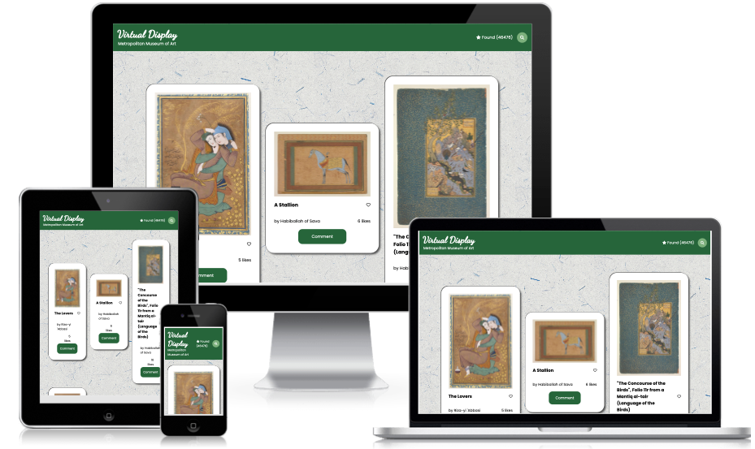

# Metropolitan Museum of Art

> This project displays the art collection using the Metropolitan Museum of Art API. For this project we used HTML, CSS, Javascript, Webpack and Jest.
> We describe the features of our website [here](https://drive.google.com/file/d/15YUZL-H1LLVOKzSFiTDzLSB8KBPxr38U/view?usp=sharing).

## Built With

- HTML
- CSS
- JavaScript
- JEST
- Webpack
- Involvement API
- Metropolitan Museum of Art API

## Getting Started

To get a local copy up and running follow these simple example steps.

### Prerequisites

- NPM
- Modern Web Browser
- Git

### Live link

Check the live version [here](https://indigodavid.github.io/metropolitan-museum-of-art/)

### Setup

    $ git clone https://github.com/indigodavid/metropolitan-museum-of-art.git

### Install

    $ npm install

### Usage

    $ npm run build
    $ npm start

### Run tests

    $ npm test 
### Deployment

    $ npm run deploy

## Authors

👤 **Brenda Wihogora**

- GitHub: [@Brenda309](https://github.com/Brenda309)
- Twitter: [@BrendaWihogora](https://twitter.com/BrendaWihogora)
- LinkedIn: [LinkedIn](www.linkedin.com/in/brenda-wihogora)

👤 **David Vera**

- GitHub: [@indigodavid](https://github.com/indigodavid)
- Twitter: [@indigo1987](https://twitter.com/indigo1987)
- LinkedIn: [LinkedIn](https://linkedin.com/in/davidveracastillo/)

## 🤝 Contributing

Contributions, issues, and feature requests are welcome!

Feel free to check the [issues page](../../issues/).

## Show your support

Give a ⭐️ if you like this project!

## Acknowledgments

- Background image created by [RawPixel](rawpixel.com)
- Metropolitan Museum of Art
- Hat tip to anyone whose code was used
- Microverse
- Our supportive families 😊

## 📝 License

This project is [MIT](./MIT.md) licensed.
